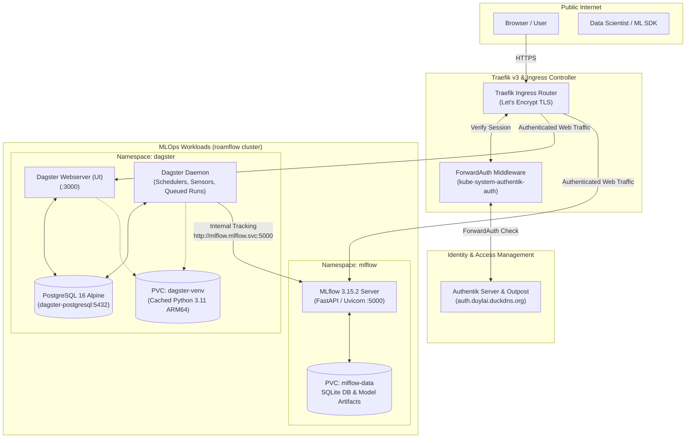

# Roamflow GitOps & MLOps Platform

[](https://k3s.io/)
[](https://arm.com)
[](https://argo-cd.readthedocs.io/)
[](https://goauthentik.io/)
[](https://mlflow.org)

Declarative GitOps repository and infrastructure definitions for **`roamflow`**, a multi-node ARM64 Kubernetes cluster hosted on Oracle Cloud Infrastructure (OCI Always Free Tier). It hosts production-grade developer tooling, monitoring, and an end-to-end modern **MLOps platform (MLflow + Dagster)** secured by **Authentik Single Sign-On (SSO)**.

---

## Architecture Overview



---

## Services & Exposed Endpoints

All services are exposed via Traefik with automatic Let's Encrypt certificates issued by `cert-manager`:

| Service | Namespace | Hostname | Description | Authentication |
| :--- | :--- | :--- | :--- | :--- |
| **Dagster Platform** | `dagster` | `https://dagster.duylai.duckdns.org` | Asset-based data & ML orchestrator UI | Authentik SSO (ForwardAuth) |
| **MLflow Server** | `mlflow` | `https://mlflow.duylai.duckdns.org` | Experiment tracking & model registry (v3.15.2) | Authentik SSO (ForwardAuth) |
| **Authentik SSO** | `authentik` | `https://auth.duylai.duckdns.org` | Centralized identity provider & proxy outpost | Native Authentik Auth |
| **Grafana Dashboards** | `monitoring` | `https://grafana.duylai.duckdns.org` | Metrics visualization & cluster dashboards | Authentik OIDC OAuth |
| **Headlamp** | `headlamp` | `https://headlamp.duylai.duckdns.org` | Kubernetes cluster management dashboard | Authentik SSO (ForwardAuth) |
| **Gitea** | `gitea` | `https://gitea.duylai.duckdns.org` | Self-hosted Git & OCI container registry | Authentik OIDC OAuth |
| **Vikunja** | `vikunja` | `https://tasks.duylai.duckdns.org` | Task and project management platform | Authentik OIDC OAuth |
| **Stirling PDF** | `stirling-pdf` | `https://pdf.duylai.duckdns.org` | Web-based PDF manipulation utilities | Public / Direct |
| **Argo CD** | `argocd` | `https://argocd.duylai.duckdns.org` | Declarative GitOps deployment engine | Local / Admin Secret |

---

## MLOps Stack Deep Dive

### 1. MLflow Tracking Server (`apps/mlflow`)
* **Engine**: MLflow `v3.15.2` running on FastAPI / Uvicorn with native `linux/arm64` support.
* **Storage**: Single 10 GiB `local-path` PersistentVolumeClaim storing both SQLite database (`/mlflow/mlflow.db`) and artifact models (`/mlflow/artifacts`).
* **Resource Optimization**: Tuned with `--workers 1` (Uvicorn async), `requests: 1.5Gi`, and `limits: 3Gi` to ensure zero OOM crashes while maintaining high throughput.
* **Internal Networking**: Other pods inside the cluster communicate directly via `http://mlflow.mlflow.svc.cluster.local:5000`, bypassing Ingress authentication.

### 2. Dagster Data Platform (`apps/dagster`)
* **Architecture**: Fully modular setup separating control plane and storage:
  * `dagster-postgresql`: Dedicated `postgres:16-alpine` database pod (~40 MB RAM) holding run logs, schedules, and event records.
  * `dagster-webserver`: Interactive UI on port 3000.
  * `dagster-daemon`: Background supervisor running `AssetDaemon`, `SchedulerDaemon`, `SensorDaemon`, and `QueuedRunCoordinatorDaemon`.
* **ARM64 Python Environment Caching**:
  * An `initContainer` builds a dedicated Python 3.11 virtual environment into a shared PVC (`dagster-venv`) on the first boot (~20 seconds).
  * Subsequent restarts attach to the pre-built virtual environment instantly (~0.5 seconds).
* **Pre-configured Asset**: Includes an integrated `sample_ml_asset` demonstrating automated logging of parameters and metrics to internal MLflow server (`http://mlflow.mlflow.svc:5000`).

---

## Single Sign-On (SSO) Workflow

Web UIs without built-in OIDC support (MLflow, Dagster, Headlamp) are protected using **Traefik ForwardAuth**:

1. **Ingress Middleware**: Ingress manifests include:
   ```yaml
   traefik.ingress.kubernetes.io/router.middlewares: kube-system-redirect-https@kubernetescrd,kube-system-authentik-auth@kubernetescrd
   ```
2. **Authentik Proxy Provider Configuration**:
   * In Authentik Admin Console (`https://auth.duylai.duckdns.org`), create a **Proxy Provider**:
     * **Mode**: `Forward auth (single application)`
     * **External host**: `https://<service>.duylai.duckdns.org`
     * **Authentication URL**: `https://auth.duylai.duckdns.org`
   * Bind the Provider to an Application and assign it to the `authentik Embedded Outpost`.

---

## GitOps Repository Structure

```text
devops/
├── bootstrap/                          # Cluster initialization scripts
├── clusters/
│   └── roamflow/                       # Root App-of-Apps & Application manifests
│       ├── root-app.yaml               # Entrypoint application
│       ├── infrastructure.yaml         # Core cluster components (cert-manager, middlewares)
│       ├── dagster.yaml                # Argo CD Application for Dagster
│       ├── mlflow.yaml                 # Argo CD Application for MLflow
│       ├── authentik.yaml              # Argo CD Application for Authentik SSO
│       ├── monitoring.yaml             # Prometheus & Grafana stack
│       └── kustomization.yaml
├── infrastructure/                     # Cluster-wide resources
│   ├── cert-manager/                   # Let's Encrypt ACME ClusterIssuer
│   ├── middlewares/                    # Traefik redirect-https & authentik-auth
│   └── argocd/                         # Argo CD Ingress
└── apps/                               # Workload manifests
    ├── authentik/                      # Identity & SSO platform Helm chart
    ├── dagster/                        # Dagster Webserver, Daemon & PostgreSQL
    │   ├── dagster.yaml                # Core deployments, services & PVCs
    │   ├── dagster-config.yaml         # ConfigMap (dagster.yaml, workspace.yaml, repo.py)
    │   ├── sealed-secret.yaml          # Encrypted PostgreSQL credentials
    │   └── kustomization.yaml
    ├── mlflow/                         # MLflow 3.15.2 Tracking Server & SQLite
    │   ├── mlflow.yaml                 # Deployment, service, PVC, and ingress
    │   └── kustomization.yaml
    ├── gitea/                          # Gitea Git service & container registry
    ├── headlamp/                       # Headlamp Kubernetes dashboard
    ├── monitoring/                     # kube-prometheus-stack Helm values
    ├── stirling-pdf/                   # PDF web tools
    └── vikunja/                        # Vikunja task manager
```

---

## Secrets Management (Bitnami Sealed Secrets)

All sensitive data committed to Git is encrypted using Bitnami Sealed Secrets (`kubeseal`):

```bash
# 1. Create a local unencrypted secret (do NOT commit)
kubectl create secret generic my-secret \
  --namespace my-namespace \
  --from-literal=PASSWORD=supersecret \
  --dry-run=client -o yaml > secret.yaml

# 2. Encrypt with kubeseal
kubeseal --controller-name=sealed-secrets-controller \
  --controller-namespace=kube-system \
  --format yaml < secret.yaml > apps/my-app/sealed-secret.yaml

# 3. Safely commit sealed-secret.yaml to Git
git add apps/my-app/sealed-secret.yaml
git commit -m "feat(secret): add encrypted secret"
git push origin main
```

---

## Operations & Verification

```bash
# Verify Argo CD applications status
kubectl get applications -n argocd

# Check all pods in the MLOps namespaces
kubectl get pods -n mlflow
kubectl get pods -n dagster

# Test Kustomize builds locally
kubectl kustomize apps/mlflow/
kubectl kustomize apps/dagster/
kubectl kustomize clusters/roamflow/

# Check certificate readiness
kubectl get certificates -A
```

---

## License

Personal project repository maintained by [Duy Lai](https://github.com/roamflow). Distributed for private infrastructure management.
